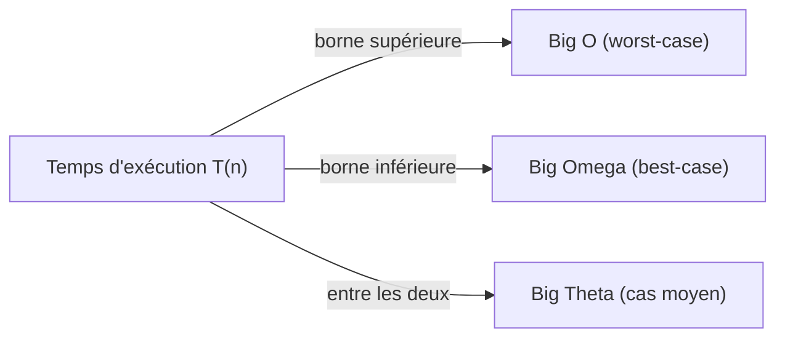
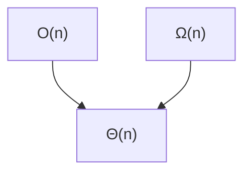

# Cours Avancé en Algorithmique — Séance 1 : Rappels et Introduction avancée  
## Partie 1 : Théorie — Complexité Algorithmique (1h)  
### Contenu : Rappel des Notations (O, Ω, Θ)

---

## Introduction

L'analyse de la complexité algorithmique est un outil fondamental pour comprendre les performances d'un algorithme. Les notations asymptotiques Big O (O), Big Omega (Ω) et Big Theta (Θ) permettent de caractériser le comportement d’un algorithme en fonction de la taille d'entrée \( n \).

---

## 1. Notations Asymptotiques : Définitions et Interprétations

### 1.1 Big O : La Majorante (Upper Bound)

- **Définition :** La notation Big O, notée \( O(f(n)) \), exprime une **borne supérieure asymptotique** sur le temps (ou l’espace) d’exécution d’un algorithme.
- **Interprétation :** Pour \( n \) suffisamment grand, le temps d’exécution de l’algorithme **ne dépasse jamais** un certain multiple de \( f(n) \).
- **Cas typique :** Analyse dans le **pire des cas (worst-case)**.

\[
T(n) \in O(f(n)) \iff \exists c > 0, n_0 > 0, \forall n \geq n_0, T(n) \leq c \times f(n)
\]

### 1.2 Big Omega (Ω) : La Minorante (Lower Bound)

- **Définition :** La notation Big Omega, notée \( \Omega(f(n)) \), exprime une **borne inférieure asymptotique**.
- **Interprétation :** Pour \( n \) assez grand, le temps d’exécution est au moins un certain multiple de \( f(n) \).
- **Cas typique :** Analyse dans le **meilleur des cas (best-case)**.

\[
T(n) \in \Omega(f(n)) \iff \exists c > 0, n_0 > 0, \forall n \geq n_0, T(n) \geq c \times f(n)
\]

### 1.3 Big Theta (Θ) : La Bounding Tight (Encadrement)

- **Définition :** La notation Big Theta, notée \( \Theta(f(n)) \), donne une **borne serrée** — à la fois supérieure et inférieure.
- **Interprétation :** Pour \( n \) suffisamment grand, le temps d’exécution est proportionnel à \( f(n) \) à une constante près.
- **Cas typique :** Analyse dans le **cas moyen (average-case)**, lorsque les bornes convergent.

\[
T(n) \in \Theta(f(n)) \iff T(n) \in O(f(n)) \text{ et } T(n) \in \Omega(f(n))
\]

---

## 2. Illustration par un Exemple Simple

Considérons un algorithme dont le temps d’exécution \( T(n) \) dépend d’une boucle imbriquée, où \( n \) est la taille de l’entrée.

```c
for (int i = 0; i < n; i++) {
    for (int j = 0; j < n; j++) {
        // instruction en temps constant
    }
}
```

- Le temps d’exécution est approximativement proportionnel à \( n^2 \).
- **Big O** : \( T(n) \in O(n^2) \) car dans le pire cas, les deux boucles s’exécutent totalement.
- **Big Omega** : \( T(n) \in \Omega(n^2) \), car même dans le meilleur cas, toutes les instructions sont parcourues.
- **Big Theta** : \( T(n) \in \Theta(n^2) \), car le comportement est borné strictement autour de \( n^2 \).

---

## 3. Illustrations Graphiques avec Mermaid

Voici une visualisation simplifiée des relations entre les complexités dans un exemple typique :



Un autre diagramme illustre l’encadrement possible :



---

## 4. Résumé des Notations

| Notation | Type de Borne | Cas d’étude      | Exemple d'utilisation           |
|----------|---------------|------------------|--------------------------------|
| \( O(f(n)) \)     | Majorante (supérieure) | Pire cas (worst-case)   | Limite max de temps d’exécution |
| \( \Omega(f(n)) \) | Minorante (inférieure) | Meilleur cas (best-case) | Limite min de temps d’exécution |
| \( \Theta(f(n)) \) | Serrée (tight bound)   | Cas moyen (average-case) | Le temps est proportionnel à \( f(n) \) |

---

## 5. Sources Utilisées

- [Builtin - Big O vs Big Theta vs Big Omega Notation Differences Explained](https://builtin.com/software-engineering-perspectives/big-o-vs-big-theta)  
- [Medium - Understanding Big O, Big Theta (Θ), and Big Omega (Ω) Notations](https://medium.com/@adnan.mehrat/understanding-big-o-big-theta-%CE%B8-and-big-omega-%CF%89-notations-in-algorithm-analysis-7f876aa922b4)  
- [Medium - A Guide to Understanding Big-O, Big-Ω and Big-ϴ Notation](https://medium.com/@alejandro.itoaramendia/a-guide-to-understanding-big-o-big-%CF%89-and-big-%CE%B8-notation-7c407a6824d9)  

---

Ce cours donne donc une vision claire et résumée des notations asymptotiques, fondement indispensable pour la conduite d'analyses fines et précises des algorithmes avancés en langage C.
