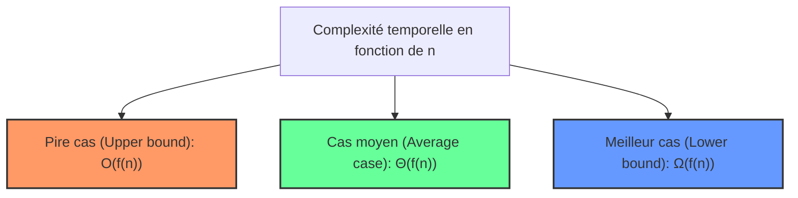

# Cours Avancé en Algorithmique — Séance 1 : Rappels et Introduction avancée  
## Partie 1 : Théorie — Complexité Algorithmique (1h)  
### Contenu : Analyse de cas (pire, meilleur, moyen)

---

## 1. Introduction aux différents cas d’analyse algorithmique

L’analyse de la complexité d’un algorithme ne se limite pas à une seule mesure. Elle considère principalement trois scénarios qui reflètent des comportements différents selon la nature des données d’entrée :

- **Meilleur cas**
- **Pire cas**
- **Cas moyen**

Chacun donne une indication distincte sur les performances d’un algorithme, et leur compréhension permet d’évaluer de manière plus réaliste son efficacité dans diverses situations.

---

## 2. Definitions

### 2.1 Le Pire Cas (Worst Case)

- Représente la situation où l’algorithme effectue **le nombre maximal d’opérations** possibles pour une entrée de taille \( n \).
- Utile pour **garantir un temps d’exécution maximal**, important dans les applications critiques.
- Noté souvent avec la borne supérieure \( O(f(n)) \).

### 2.2 Le Meilleur Cas (Best Case)

- Correspond à la situation où l’algorithme effectue **le nombre minimal d’opérations**.
- Rarement utilisé seul car peu représentatif du comportement moyen, mais permet parfois des optimisations.
- Noté souvent avec la borne inférieure \( \Omega(f(n)) \).

### 2.3 Le Cas Moyen (Average Case)

- Exprime la **complexité moyenne** sur toutes les entrées possibles de taille \( n \).
- Plus difficile à calculer car nécessite de connaître **la distribution des entrées**.
- S’approxime souvent par \( \Theta(f(n)) \) si elle est connue.

---

## 3. Exemples illustratifs

### 3.1 Recherche linéaire

Considérons une liste non triée de taille \( n \) et une fonction cherchant un élément \( x \).

```c
int recherche_lineaire(int tab[], int n, int x) {
    for (int i = 0; i < n; i++) {
        if (tab[i] == x) return i; // retour dès la première occurrence
    }
    return -1; // si pas trouvé
}
```

| Cas               | Complexité              | Explication                                         |
|-------------------|------------------------|----------------------------------------------------|
| **Meilleur cas**  | \( \Omega(1) \)          | \( x \) est en première position                   |
| **Pire cas**      | \( O(n) \)             | \( x \) est absent ou en dernière position         |
| **Cas moyen**     | \( \Theta(n) \)         | En moyenne, \( x \) est autour de la moitié        |

---

### 3.2 Tri à bulles (Bubble sort)

Analyse simplifiée pour un tri de \( n \) éléments :

- **Meilleur cas :** Le tableau est déjà trié. La complexité est \( \Omega(n) \) car il parcours au moins une fois la liste.
- **Pire cas :** Le tableau est trié à l’envers. Complexité \( O(n^2) \) car beaucoup de permutations sont nécessaires.
- **Cas moyen :** Complexité \( \Theta(n^2) \) par analyse statistique des permutations aléatoires.

---

## 4. Diagramme de comparaison des cas de complexité



---

## 5. Points importants

- **Le pire cas** est omniprésent dans la littérature car il garantit une capacité maximale à gérer toutes les entrées.
- **Le meilleur cas** est souvent négligé car il peut être trop optimiste (exemple : liste déjà triée pour certains tris).
- **Le cas moyen** est le plus représentatif mais parfois complexe à calculer car nécessite des hypothèses sur la distribution des données d’entrée.
- Les notations Big O, Big Ω et Big Θ sont liées respectivement au pire cas, au meilleur cas, et au cas moyen.

---

## 6. Sources consultées

- [Univ. de la Réunion - Complexité des algorithmes](http://lim.univ-reunion.fr/staff/fred/Enseignement/Info4/Pascal/Complexite/Cours/cours/cours.html)  
- [Cours PDF - Université d'Ottawa](https://www.site.uottawa.ca/~stan/csi2514/trs/csi2514-4x.pdf)  
- [MarcArea - Complexité algorithmique et notation Grand O](https://marcarea.com/weblog/2019/01/21/complexite-algorithmique-et-notation-grand-o)  
- [JP Zanotti - Algorithmique et complexité](https://zanotti.univ-tln.fr/ALGO/II/Complexite.html)  
- [LRI - Algorithmique et complexité (PDF)](https://www.lri.fr/~fpirot/teaching/peip2/cours.pdf)  

---

Ce cours synthétise les notions clés de l’analyse algorithmique dans différents cas — la base nécessaire pour approfondir la complexité en algorithmique avancée.
