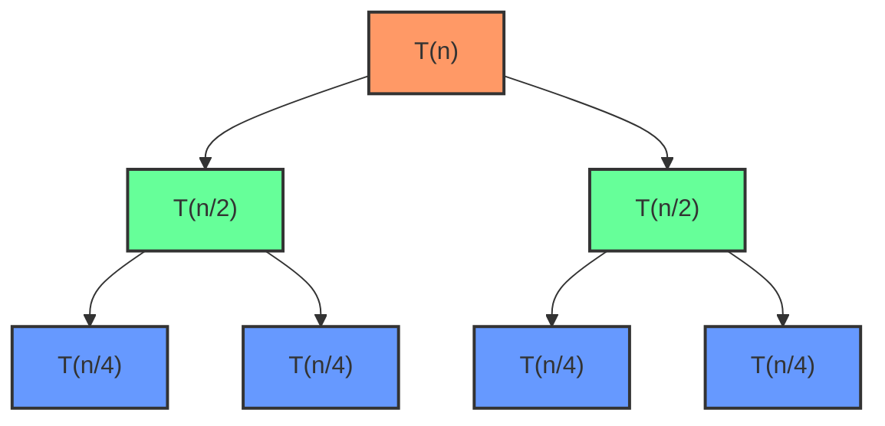

# Cours Avancé en Algorithmique — Séance 1 : Rappels et Introduction avancée  
## Partie 1 : Théorie — Complexité Algorithmique (1h)  
### Contenu : Calcul de complexité pour des algorithmes récursifs et itératifs

---

## 1. Introduction

Analyser la complexité d’un algorithme consiste à évaluer le nombre d’opérations effectuées en fonction de la taille de l’entrée \( n \). Cette analyse diffère selon que l’algorithme soit **itératif** (boucles) ou **récursif** (appels répétés à lui-même).

---

## 2. Complexité des algorithmes itératifs

### 2.1 Principes

- S’appuie généralement sur des boucles simples ou imbriquées.
- Le calcul de complexité consiste à compter le nombre d’itérations.
- Exemple classique : une boucle simple exécute un nombre d’opérations proportionnel à \( n \), soit \( O(n) \).

### 2.2 Exemple

```c
void somme_iterative(int n) {
    int somme = 0;
    for (int i = 1; i <= n; i++) {
        somme += i; // opération constante
    }
}
```

- Complexité : \( T(n) = O(n) \).

### 2.3 Boucles imbriquées

```c
void produit_iteratif(int n) {
    for (int i = 1; i <= n; i++) {
        for (int j = 1; j <= n; j++) {
            // opération constante
        }
    }
}
```

- Complexité : \( T(n) = O(n^2) \).

---

## 3. Complexité des algorithmes récursifs

### 3.1 Principe et équations de récurrence

- La complexité est souvent exprimée par une **relation de récurrence** (équation qui définit \( T(n) \) en fonction de \( T \) de sous-problèmes plus petits).
- Pour analyser, on résout cette relation pour trouver la forme explicite de \( T(n) \).

### 3.2 Exemple simple : Somme récursive

```c
int somme_recursive(int n) {
    if (n == 0) return 0;
    return n + somme_recursive(n - 1);
}
```

- Relation de récurrence :

\[
T(n) = T(n-1) + O(1), \quad T(0) = O(1)
\]

- Résolution :

\[
T(n) = O(n)
\]

### 3.3 Exemple classique : Factorielle

```c
int factorielle(int n) {
    if (n <= 1) return 1;
    return n * factorielle(n - 1);
}
```

- Relation similaire, complexité en \( O(n) \).

---

### 3.4 Analyse d’un algorithme récursif diviser pour régner (exemple du tri fusion)

```c
void tri_fusion(int tab[], int deb, int fin) {
    if (deb < fin) {
        int milieu = (deb + fin)/2;
        tri_fusion(tab, deb, milieu);
        tri_fusion(tab, milieu + 1, fin);
        fusion(tab, deb, milieu, fin); // fusion en O(n)
    }
}
```

- La relation de récurrence de complexité est :

T(n)=2T(n/2)+O(n)

- Par le théorème de maître, cette relation se résout en :

\[
T(n) = O(n \log n)
\]

---

| Cas   | Condition sur **f(n)**                                                                           | Qui domine ?                          | Résultat                                   |
| ----- | ------------------------------------------------------------------------------------------------ | ------------------------------------- | ------------------------------------------ |
| **1** | $f(n) = O(n^{\log_b a - \epsilon})$ (f(n) plus petit)                                            | La **récursion** (les sous-problèmes) | $T(n) = \Theta(n^{\log_b a})$              |
| **2** | $f(n) = \Theta(n^{\log_b a})$ (f(n) du même ordre)                                               | Équilibre entre récursion et fusion   | $T(n) = \Theta(n^{\log_b a} \cdot \log n)$ |
| **3** | $f(n) = \Omega(n^{\log_b a + \epsilon})$ (f(n) plus grand) et condition technique (*regularity*) | Le **travail hors récursion** (f(n))  | $T(n) = \Theta(f(n))$                      |

En résumé : le théorème de maître, c’est un tableau de recettes qui dit :

« tu divises ton problème comment ? »

« ça te coûte quoi en plus ? »

et il te donne directement le temps final de ton algorithme

donc :

a = 2 (on crée 2 sous-problèmes)

b = 2 (chaque sous-problème fait la moitié de la taille)

f(n) = O(n)

La récursion toute seule coûterait environ n log n

Le travail hors récursion (la fusion) coûte n

On est donc dans le cas 2 → résultat :

T(n)=O(nlogn)

---

## 4. Techniques pour résoudre une relation de récurrence

Une relation de récurrence peut s’aborder par :

- **Méthode d’expansion (développement itératif)** : déplier la récursion plusieurs fois.
- **Théorème de maîtrise (Master theorem)** : formules standards pour certaines relations.
- **Arbre de récursion** : visualiser les appels récursifs et la somme des coûts.

---

## 5. Diagramme d'arbre de récursion du tri fusion



---

## 6. Comparaison entre récursion et itération

| Aspect                                    | Itération                     | Récursion                              |
|-------------------------------------------|-------------------------------|---------------------------------------|
| Écriture                                 | Boucles (for, while)          | Appels de fonction récursive          |
| Complexité temporelle                     | Généralement plus directe      | Analyse par équations de récurrence   |
| Complexité en mémoire                     | Constante ou faible            | Peut être plus élevée (pile d’appels) |
| Utilisation pratique                      | Simple ou complexe             | Naturel pour problèmes divisés         |

---

## 7. Sources consultées

- [Geeks for Geeks - Time Complexity analysis of recursive/iterative algorithms](https://www.geeksforgeeks.org/time-complexity-of-recursive-and-iterative-algorithms/)
- [MIT OpenCourseWare - Introduction to Algorithms](https://ocw.mit.edu/courses/6-006-introduction-to-algorithms-spring-2020/resources/lecture-2-asymptotic-analysis/)
- [Stanford CS Education Library - Recurrence Relations and Master Theorem](https://web.stanford.edu/class/archive/cs/cs161/cs161.1168/lectures/01/Small01.pdf)
- [Khan Academy - Recursive Algorithms](https://www.khanacademy.org/computing/computer-science/algorithms/recursive-algorithms/a/recursion)
- [Wikipedia - Recurrence relation](https://fr.wikipedia.org/wiki/Relation_de_récurrence)

---

Ce cours propose une méthode claire pour calculer la complexité des algorithmes itératifs et récursifs, en s’appuyant sur la résolution de relations de récurrence, véritable outil dans l'analyse algorithmique avancée.
