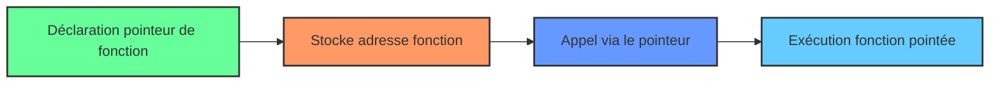

# Cours Avancé en Algorithmique — Séance 1 : Rappels et Introduction avancée  
## Partie 2 : Théorie — Optimisation et Gestion Mémoire Avancée (0.5h)  
### Contenu : Utilisation avancée des pointeurs et des pointeurs de fonctions

---

## 1. Introduction

Les pointeurs en langage C sont au cœur de la gestion mémoire et de la flexibilité du code. Leur usage avancé, notamment celui des **pointeurs de fonctions**, permet d’écrire des programmes modulaires, optimisés et dynamiques. Ce cours synthétise leurs concepts et usages avancés avec exemples et illustrations.

---

## 2. Pointeurs avancés

### 2.1 Notion de pointeur de pointeur

Un pointeur peut lui-même pointer vers un autre pointeur. Utile pour manipuler des tableaux dynamiques à plusieurs dimensions ou modifier des adresses dans des fonctions.

```c
int a = 10;
int *ptr = &a;      // pointeur sur int
int **pptr = &ptr;  // pointeur sur pointeur sur int
```

- Accès via : `**pptr` pour obtenir la valeur 10.

### 2.2 Pointeurs et tableaux dynamiques

Pour une matrice, allocation et accès se font via un pointeur de pointeur.

```c
int **matrice = malloc(rows * sizeof(int *));
for (int i = 0; i < rows; i++) {
    matrice[i] = malloc(cols * sizeof(int));
}
```

Libération mémoire correspondante requise.

---

## 3. Pointeurs de fonctions

### 3.1 Déclaration et utilisation

Un pointeur de fonction stocke l’adresse d’une fonction, permettant d'appeler la fonction via ce pointeur.

```c
int addition(int a, int b) { return a + b; }

int (*ptr_fonction)(int, int) = &addition;

int resultat = ptr_fonction(5, 3); // resultat = 8
```

### 3.2 Usage en programmation

- **Callbacks:** fonctions passées en argument pour personnaliser des algorithmes.
- **Tables de dispatch:** sélection dynamique de fonctions.
- **Gestion d’état et événements** dans des systèmes embarqués.

---

## 4. Exemples pratiques

### 4.1 Tri générique avec pointeur de fonction pour comparaison

```c
int comparer_asc(const void *a, const void *b) {
    return (*(int*)a - *(int*)b);
}

int comparer_desc(const void *a, const void *b) {
    return (*(int*)b - *(int*)a);
}

void tri_generique(int *tab, size_t n, int (*cmp)(const void*, const void*)) {
    for (size_t i = 0; i < n - 1; i++) {
        for (size_t j = i + 1; j < n; j++) {
            if (cmp(&tab[i], &tab[j]) > 0) {
                int temp = tab[i];
                tab[i] = tab[j];
                tab[j] = temp;
            }
        }
    }
}
```

Appel :

```c
tri_generique(tab, n, comparer_asc);
```

---

### 4.2 Diagramme Mermaid : Fonctionnement pointeur de fonction



---

## 5. Risques et bonnes pratiques

- **Nullité du pointeur:** toujours vérifier un pointeur de fonction avant usage.
- **Correspondance signature:** le prototype doit correspondre strictement.
- **Gestion de la mémoire:** s’assurer de la validité des pointeurs manipulés.
- **Lisibilité:** commenter les pointeurs complexes pour éviter la confusion.

---

## 6. Sources et approfondissements

- [TutorialsPoint — Pointers in C](https://www.tutorialspoint.com/cprogramming/c_pointers.htm)  
- [GeeksforGeeks — Function Pointers in C](https://www.geeksforgeeks.org/function-pointer-in-c/)  
- [CProgramming — Using Function Pointers](https://www.cprogramming.com/tutorial/function-pointers.html)  
- [Wikipedia — Pointer (computer programming)](https://en.wikipedia.org/wiki/Pointer_(computer_programming))  
- [Modern C — Advanced Pointers](https://modernc.gforge.inria.fr/html/adv-pointers.html)  

---

La maîtrise des pointeurs, notamment des pointeurs de fonctions, apporte une flexibilité essentielle à l’écriture de logiciels modulaires et performants, permettant des techniques avancées d’abstraction et d’optimisation en C.