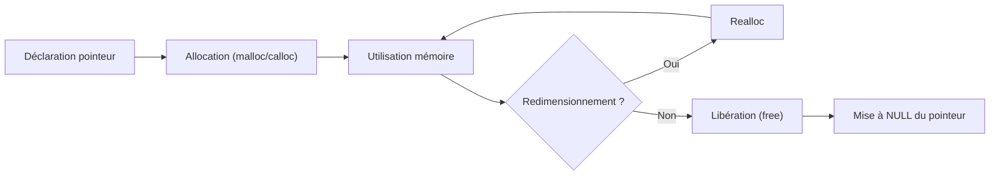

# Cours Avancé en Algorithmique — Séance 1 : Rappels et Introduction avancée  
## Partie 2 : Théorie — Optimisation et Gestion Mémoire Avancée (0.5h)  
### Contenu : `malloc`, `calloc`, `realloc`, `free` — bonnes pratiques et erreurs courantes (fuites mémoire, pointeurs sauvages)

---

## 1. Introduction

La gestion dynamique de la mémoire en C repose sur quatre fonctions majeures :  
- `malloc` (allocation mémoire non initialisée)  
- `calloc` (allocation mémoire initialisée à zéro)  
- `realloc` (redimensionnement d’un bloc mémoire)  
- `free` (libération mémoire)  

La maîtrise de ces fonctions est indispensable pour écrire des programmes stables, performants et sans fuites mémoire.

---

## 2. Présentation des fonctions

| Fonction | Usage | Signature | Particularités |
|---|---|---|---|
| `malloc` | Allouer un bloc mémoire brut, non initialisé | `void *malloc(size_t size);` | Retourne pointeur vers mémoire non initialisée; NULL si échec |
| `calloc` | Allouer et initialiser à 0 | `void *calloc(size_t nmemb, size_t size);` | Initialise chaque octet à 0 |
| `realloc` | Redimensionner un bloc mémoire | `void *realloc(void *ptr, size_t size);` | Peut déplacer le bloc; copie éventuellement |
| `free` | Libérer un bloc mémoire | `void free(void *ptr);` | Accepte NULL sans effet |

---

## 3. Bonnes pratiques d’utilisation

### 3.1 Initialisation des pointeurs

Toujours initialiser les pointeurs dynamiques à `NULL`. Cela évite d’appeler `free` sur des adresses non valides.

```c
int *ptr = NULL;
ptr = malloc(sizeof(int) * 10);
if (ptr == NULL) {
    // gestion erreur allocation
}
```

### 3.2 Vérification d’allocation

Toujours tester le retour de `malloc`, `calloc` ou `realloc` avant utilisation.

```c
void *temp = realloc(ptr, new_size);
if (temp == NULL) {
    // erreur, traiter proprement
} else {
    ptr = temp;
}
```

### 3.3 Libération mémoire

Ne jamais oublier d’appeler `free` pour chaque bloc alloué, sinon **fuite mémoire**.

```c
free(ptr);
ptr = NULL;  // éviter pointeur sauvage
```

### 3.4 Guarder les pointeurs valides

Après libération, mettre le pointeur à `NULL` afin d’éviter un usage ultérieur erroné (pointeur sauvage).

---

## 4. Erreurs courantes

### 4.1 Fuites mémoire

Ne pas libérer un bloc alloué, ou perdre le pointeur (écrasement sans `free`).

```c
ptr = malloc(100);
//...
ptr = malloc(200);  // fuite mémoire de l’ancien bloc si pas free avant
```

### 4.2 Pointeurs sauvages

Utiliser un pointeur après l’avoir libéré.

```c
free(ptr);
// utilisation de ptr encore pointeur non NULL -> comportement indéfini
```

### 4.3 Double libération

Libérer deux fois le même bloc, ce qui provoque une erreur de segmentation souvent difficile à déboguer.

```c
free(ptr);
free(ptr);
```

### 4.4 Mauvais usage de `realloc`

Réaffecter directement le résultat de `realloc` sans sauvegarder peut entraîner la perte du pointeur original en cas d’échec.

---

## 5. Exemple complet

```c
#include <stdio.h>
#include <stdlib.h>

int main() {
    int *tab = NULL;
    size_t taille = 5;

    // Allocation initiale
    tab = malloc(taille * sizeof(int));
    if (!tab) {
        perror("malloc failed");
        return EXIT_FAILURE;
    }

    // Utilisation
    for (size_t i = 0; i < taille; i++) tab[i] = i;

    // Redimensionnement
    int *temp = realloc(tab, 2 * taille * sizeof(int));
    if (!temp) {
        free(tab);
        perror("realloc failed");
        return EXIT_FAILURE;
    }
    tab = temp;

    // Initialisation nouvelles cases
    for (size_t i = taille; i < 2 * taille; i++) tab[i] = 0;

    // Libération
    free(tab);
    tab = NULL;

    return EXIT_SUCCESS;
}
```

---

## 6. Diagramme — Cycle de vie mémoire dynamique



---

## 7. Sources consultées

- [GNU C Library Documentation – malloc, calloc, realloc, free](https://www.gnu.org/software/libc/manual/html_node/Allocation-Functions.html)  
- [GeeksforGeeks - Dynamic Memory Allocation in C](https://www.geeksforgeeks.org/dynamic-memory-allocation-in-c-using-malloc-calloc-free-and-realloc/)  
- [Stack Overflow – Common Mistakes with malloc and free](https://stackoverflow.com/questions/13978228/what-are-the-most-common-mistakes-in-using-malloc-and-free)  
- [Wikipedia – Dynamic Memory Allocation](https://en.wikipedia.org/wiki/Dynamic_memory_allocation)  
- [Linux Journal – Memory Management: malloc, calloc, realloc and free](https://www.linuxjournal.com/article/7459)

---

La rigueur dans l’utilisation des fonctions d’allocation dynamique et la bonne gestion des pointeurs associée sont les clés pour éviter fuites mémoire, erreurs et garantir la stabilité des programmes en C.
