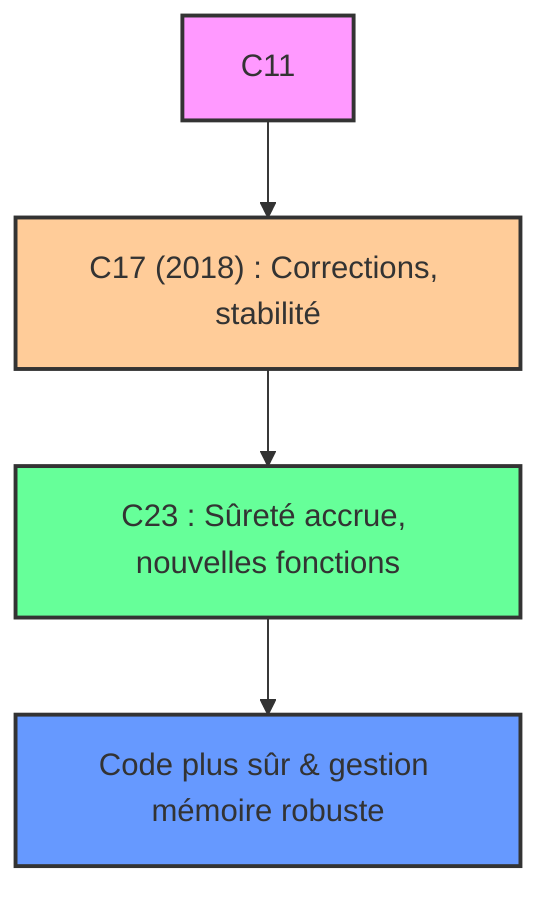

# Cours Avancé en Algorithmique — Séance 1 : Rappels et Introduction 
## Partie 2 : Théorie — Optimisation et Gestion Mémoire Avancée 
### Contenu : Introduction aux dernières évolutions du langage C (C17, C23) et leur impact potentiel sur la gestion mémoire ou la sûreté du code

---

## 1. Contexte

Le standard C continue de progresser pour améliorer notamment la sûreté, la portabilité, et les performances. Les versions récentes, **C17** (ISO/IEC 9899:2018) et la future **C23** introduisent des évolutions significatives dans la gestion mémoire et la robustesse du code.

---

## 2. Évolutions majeures de C17 (2018)

C17 est plutôt une version corrective de **C11**, visant à clarifier des comportements et corriger des défauts sans introduire de nouvelles fonctionnalités majeures.

- **Correction de bugs et ambiguïtés** dans la norme C11, notamment dans la gestion du multithreading et des fonctions standards.
- Stabilisation de fonctions de la bibliothèque standard comme `memcpy`, `memset` pour éviter les comportements indéfinis en bordure mémoire.
- Renforcement des règles sur le comportement indéfini, notamment autour des pointeurs.

**Impact** : amélioration de la sûreté d’exécution, grâce à des définitions plus précises limitant les erreurs mémoire invisibles.

---

## 3. Perspectives et nouveautés attendues avec C23

C23, encore en définition, introduit plusieurs avancées :

| Fonctionnalité | Impact sur gestion mémoire et sûreté |
|----------------|-------------------------------------|
| **Initialisation stricte des variables** | Réduction des variables non initialisées (risque mémoire alloué mais non initialisé) |
| **Allocation automatique avec `malloc_array`** | Nouvelle fonction sûre d’allocation de tableaux, évite débordement par multiplication dépassant la taille maximale (`size_t`) |
| **Déclarations imbriquées dans les blocs** | Facilite l’écriture de code plus sûr, évitant la capture involontaire de variables |
| **Améliorations des macros** | Permettent d’éviter les effets de bord non contrôlés souvent source de bugs |
| **Support renforcé des annotations `_Checked` (à suivre)** | Dans l’esprit du projet Csafe, amélioration des garanties sur les pointeurs et accès mémoire |

---

## 4. Exemple emblématique : `malloc_array`

Avant C23, l’allocation dynamique de tableaux via `malloc` pouvait provoquer un dépassement silencieux en calculant la taille totale :

```c
int *tab = malloc(n * sizeof(int));
// si n * sizeof(int) > SIZE_MAX, un débordement silencieux peut survenir.
```

Avec `malloc_array` (C23), cette opération est protégée :

```c
int *tab = malloc_array(n, sizeof(int));
if (!tab) {
    // gestion d'erreur plus sûre, évite débordement taille
}
```

---

## 5. Autres améliorations liées à la sûreté

- **Macros `__has_include` et `__has_builtin`** pour la compatibilité et optimisation conditionnelle.
- **Modifications des fonctions de la bibliothèque standard** pour garantir un fonctionnement conforme et sécurisé.
- **Amélioration des warnings dans les compilateurs** conformes C23, augmentant la détection d’erreur mémoire ouvertes à la compilation.

---

## 6. Diagramme Mermaid — Cycle d’évolution standard et impacts



---

## 7. Sources consultées

- [ISO/IEC 9899:2018 - Draft for C17](https://www.iso.org/standard/74528.html)  
- [WG14 Working Group on C Standard - Drafts and proposals](http://www.open-std.org/jtc1/sc22/wg14/)  
- [Microsoft C Blog – C23 and its new features](https://devblogs.microsoft.com/cppblog/c23-and-the-next-iteration-of-the-c-standard/)  
- [CppReference – C23 New Library Functions](https://en.cppreference.com/w/c/experimental)  
- [Red Hat Developer – C23 malloc_array and other features](https://developers.redhat.com/blog/2023/03/10/the-c23-standard-whats-new-in-c)  

---

Les évolutions du langage C via C17 et C23 visent principalement à offrir une base plus robuste et sécurisée, limitant les erreurs mémoire courantes (dépassements, pointeurs non initialisés) et ajoutant des fonctionnalités pour une allocation plus sûre, contribuant à la fiabilité et à la maintenabilité du code système et bas niveau.
