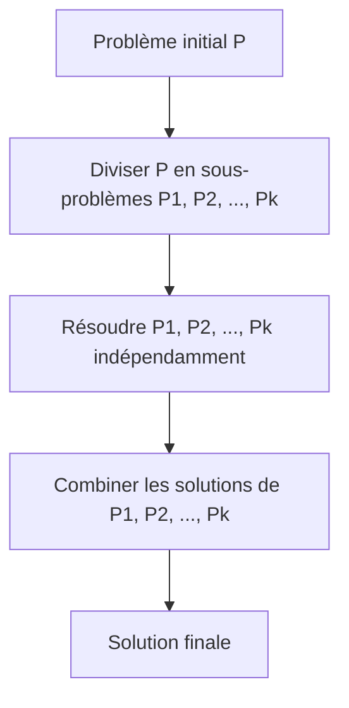
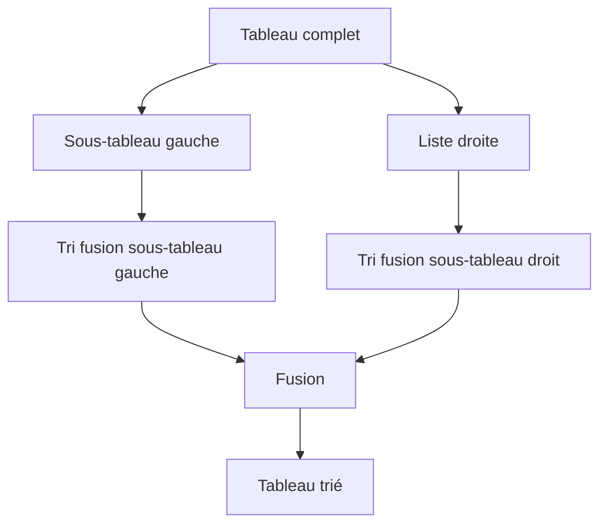

# Cours Avancé en Algorithmique — Séance 5 : Paradigmes Avancés  
## Partie 1 : Théorie — Divide & Conquer (1h)  
### Contenu : Principe général du Diviser pour Régner

---

## 1. Définition et principe

Le paradigme **Divide & Conquer** (Diviser pour Régner) est une méthode algorithmique consistant à résoudre un problème complexe en trois étapes :

1. **Diviser** : décomposer le problème en plusieurs sous-problèmes de même nature, généralement plus petits.
2. **Conquérir** : résoudre récursivement chacun des sous-problèmes.
3. **Fusionner / Combiner** : combiner les solutions partielles obtenues pour former la solution finale au problème initial.

---

## 2. Schéma général

---

## 3. Exemple classique : Tri Fusion (Merge Sort)

- **Diviser** : diviser le tableau en deux moitiés.
- **Conquérir** : trier récursivement chaque moitié.
- **Combiner** : fusionner les deux tableaux triés pour obtenir un tableau trié complet.

### Illustration Mermaid du découpage récursif

---

## 4. Avantages

- Permet de **simplifier la résolution** de problèmes complexes.
- Souvent aboutit à des algorithmes efficaces (ex : \(O(n \log n)\) pour le tri fusion).
- Algorithmique **récursive**, favorisant la clarté et modularité.
- Favorise des optimisations sur architectures parallèles.

---

## 5. Autres exemples

- **Recherche binaire** : diviser l’espace de recherche par deux.
- **Multiplication rapide de matrices** (Strassen).
- **FFT (Fast Fourier Transform)** : décomposition du problème en moitiés.

---

## 6. Analyse de complexité type

Pour un problème de taille \(n\), s’il est divisé en \(k\) sous-problèmes chacun de taille environ \(n/b\), et une opération de fusion en temps \(O(n^d)\), on obtient une récurrence:

\[
T(n) = k \times T\left(\frac{n}{b}\right) + O(n^d)
\]

- Selon le théorème maître, on peut analyser cette récurrence pour déduire la complexité globale.

---

## 7. Sources consultées

- [GeeksforGeeks — Divide and Conquer Algorithm](https://www.geeksforgeeks.org/divide-and-conquer-algorithm-introduction/)
- [Wikipedia — Divide and Conquer](https://en.wikipedia.org/wiki/Divide_and_conquer_algorithm)
- [Programiz — Divide and Conquer](https://www.programiz.com/dsa/divide-and-conquer)
- [TopCoder Tutorial — Divide and Conquer](https://www.topcoder.com/thrive/articles/Divide%20and%20Conquer)

---

Le paradigme **Diviser pour Régner** est fondamental et forme la base de nombreux algorithmes à haute performance. Comprendre son mécanisme prépare à l’analyse et la conception d’algorithmes récursifs efficaces et bien structurés.