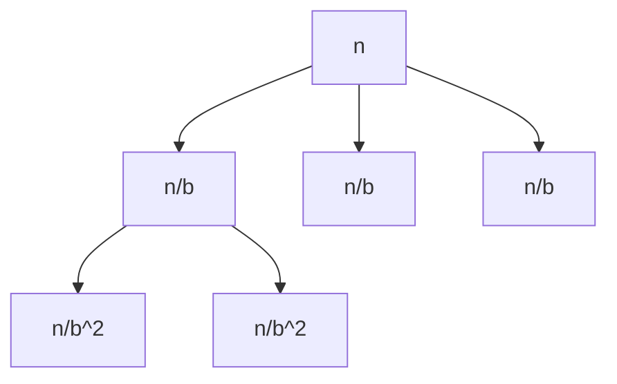

# Cours Avancé en Algorithmique — Séance 5 : Paradigmes Avancés  
## Partie 1 : Théorie — Divide & Conquer (1h)  
### Contenu : Analyse des récurrences — Introduction au Théorème Maître (Master Theorem)

---

## 1. Contexte

Les algorithmes **Divide & Conquer** se traduisent souvent par une relation de récurrence décrivant leur complexité. Ce type de récurrence est de la forme :

\[
T(n) = a \cdot T\left(\frac{n}{b}\right) + f(n)
\]

- \(a\) : nombre de sous-problèmes,
- \(n/b\) : taille d’un sous-problème (division en \(b\)),
- \(f(n)\) : coût de la phase de division et/ou fusion.

Analyser cette récurrence permet de déterminer la complexité asymptotique \(T(n)\).

---

## 2. Énoncé simplifié du Théorème Maître

Pour \(a \geq 1\), \(b > 1\) et \(f(n)\) asymptotiquement positive,

\[
T(n) = a T\left(\frac{n}{b}\right) + f(n)
\]

avec \(f(n) = \Theta(n^d \log^k n)\) où \(d \geq 0\), \(k \geq 0\).

Le comportement de \(T(n)\) dépend de la comparaison entre \(a\) et \(b^d\) :

| Cas                     | Complexité approximative de \(T(n)\)                      |
|-------------------------|-----------------------------------------------------------|
| \(a < b^d\)             | \(T(n) = \Theta(n^d)\)                                    |
| \(a = b^d\)             | \(T(n) = \Theta(n^d \log^{k+1} n)\)                       |
| \(a > b^d\)             | \(T(n) = \Theta \left( n^{\log_b a} \right)\)             |

---

## 3. Interprétation

- \(b^d\) représente la charge de travail combinée par les subdivisions.
- \(a\) mesure le nombre de sous-problèmes.  
- Si la charge de fusion (\(f(n)\)) est plus importante, elle domine la complexité.
- Sinon, ce sont la division et récursion qui dominent.

---

## 4. Exemples pratiques

### 4.1 Tri fusion (Merge Sort)

- \(a=2\) (deux sous-problèmes),
- \(b=2\) (division par 2),
- \(f(n) = \Theta(n)\) (fusion linéaire),
- \(d=1\).

Calcul :

\[
a = 2, \quad b^d = 2^1 = 2 \implies a = b^d
\]

Donc,

\[
T(n) = \Theta(n \log n)
\]

---

### 4.2 Recherche binaire

- \(a=1\) (un seul sous-problème),
- \(b=2\),
- \(f(n) = \Theta(1)\) (travail constant),
- \(d=0\).

Calcul :

\[
a=1, \quad b^{d} = 2^{0} = 1 \implies a = b^d
\]

Donc,

\[
T(n) = \Theta(\log n)
\]

---

### 4.3 Multiplication classique

- \(a=4\),
- \(b=2\),
- \(f(n) = \Theta(n^{2})\),
- \(d=2\).

Calcul :

\[
a=4, \quad b^{d}=2^{2}=4 \implies a = b^d
\]

Donc,

\[
T(n) = \Theta(n^2 \log n)
\]

---

## 5. Illustration Mermaid : Arborescence d’un algorithme Divide & Conquer

Chaque niveau génère \(a\) sous-problèmes de taille divisée par \(b\).

---

## 6. Sources consultées

- [CLRS, Introduction to Algorithms — Master Theorem](https://en.wikipedia.org/wiki/Master_theorem_(analysis_of_algorithms))
- [GeeksforGeeks — Master Theorem](https://www.geeksforgeeks.org/analysis-algorithms-set-4-master-method-solving-recurrences/)
- [Big-O Cheat Sheet — Master Theorem](https://www.bigocheatsheet.com/)
- [Programiz — Divide and Conquer](https://www.programiz.com/dsa/divide-and-conquer)

---

Comprendre et appliquer le Théorème Maître permet d’évaluer rapidement la complexité des algorithmes récursifs de type Divide & Conquer sans résoudre explicitement la récurrence. Cette méthode est un outil fondamental en analyse d’algorithmes récursifs.