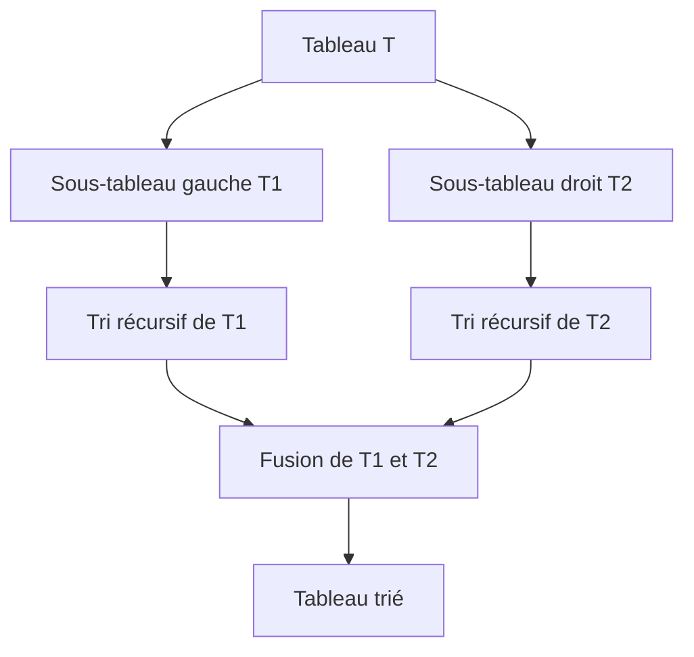

# Cours Avancé en Algorithmique — Séance 5 : Paradigmes Avancés  
## Partie 1 : Théorie — Divide & Conquer (1h)  
### Contenu : Merge Sort — principe, complexité, implémentation

---

## 1. Principe de Merge Sort

Merge Sort est un algorithme de tri fondé sur le paradigme **Divide & Conquer**. Il fonctionne en :

1. **Divisant** le tableau à trier en deux moitiés,
2. **Triant récursivement** chaque moitié,
3. **Fusionnant** les deux tableaux partiellement triés pour obtenir un tableau entièrement trié.

Il assure un tri stable, ce qui signifie que l’ordre des éléments égaux est conservé.

---

## 2. Décomposition de la méthode



- La division s'effectue jusqu’à obtenir des sous-tableaux unitaires (\(n=1\)), automatiquement triés.
- La fusion combine deux tableaux triés en temps linéaire.

---

## 3. Complexité

La complexité est caractérisée par la récurrence :

\[
T(n) = 2 \times T\left(\frac{n}{2}\right) + O(n)
\]

- Deux sous-problèmes de taille \(n/2\),
- Fusion en temps linéaire \(O(n)\).

Via le théorème maître, on obtient :

\[
T(n) = O(n \log n)
\]

Cette complexité est stable, peu importe la disposition initiale des éléments.

---

## 4. Exemple de fusion de deux tableaux triés

Fusionner \( [2,5,7] \) et \( [1,3,6,8] \) produit \( [1,2,3,5,6,7,8] \).

- Comparer éléments tête à tête,
- Prendre le plus petit et avancer dans son tableau,
- Répéter jusqu’à épuisement.

---

## 5. Implémentation C simplifiée

```c
#include <stdio.h>
#include <stdlib.h>

void fusion(int tab[], int deb, int mid, int fin) {
    int i = deb, j = mid + 1, k = 0;
    int *temp = malloc((fin - deb +1) * sizeof(int));

    while (i <= mid && j <= fin) {
        if (tab[i] <= tab[j])
            temp[k++] = tab[i++];
        else
            temp[k++] = tab[j++];
    }

    while (i <= mid)
        temp[k++] = tab[i++];
    while (j <= fin)
        temp[k++] = tab[j++];

    for (i = deb, k = 0; i <= fin; i++, k++)
        tab[i] = temp[k];

    free(temp);
}

void mergeSort(int tab[], int deb, int fin) {
    if (deb < fin) {
        int mid = (deb + fin) / 2;
        mergeSort(tab, deb, mid);
        mergeSort(tab, mid +1, fin);
        fusion(tab, deb, mid, fin);
    }
}

int main() {
    int tab[] = {5,2,7,3,9,1};
    int n = sizeof(tab)/sizeof(tab[0]);
    mergeSort(tab, 0, n-1);

    for (int i = 0; i < n; i++)
        printf("%d ", tab[i]);
    return 0;
}
```

---

## 6. Points clés

- **Stable** : préserve l’ordre des éléments égaux.
- **Complexité garantie** \(O(n \log n)\) même dans le pire cas.
- Usage intensif de mémoire auxiliaire due à la fusion.

---

## 7. Sources consultées

- [Wikipedia — Merge Sort](https://en.wikipedia.org/wiki/Merge_sort)  
- [GeeksforGeeks — Merge Sort](https://www.geeksforgeeks.org/merge-sort/)
- [Programiz — Merge Sort](https://www.programiz.com/dsa/merge-sort)
- [Big O Cheat Sheet — Merge Sort](https://www.bigocheatsheet.com/)

---

Merge Sort illustre la puissance du paradigme Divide & Conquer : diviser un problème en sous-problèmes plus gérables et combiner efficacement leurs solutions permet un tri optimal, stable et prévisible en temps d’exécution.