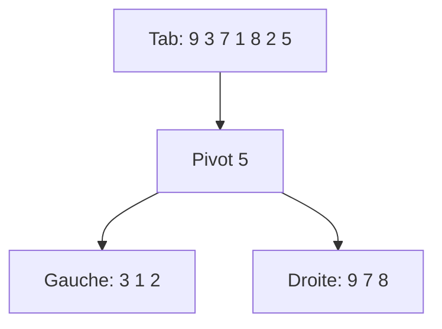

# Cours Avancé en Algorithmique — Séance 5 : Paradigmes Avancés  
## Partie 1 : Théorie — Divide & Conquer (1h)  
### Contenu : Quick Sort — principe, choix du pivot, complexité (pire, moyen), implémentation

---

## 1. Principe de Quick Sort

Quick Sort est un algorithme de tri basé sur le paradigme **Divide & Conquer** qui trie un tableau en :

1. **Choisissant un pivot** dans le tableau.
2. **Partitionnant** l’ensemble des éléments en deux sous-tableaux : à gauche les éléments inférieurs ou égaux au pivot, à droite les éléments supérieurs.
3. **Triant récursivement** chaque sous-tableau.
4. La concaténation des sous-tableaux triés produit le tableau entièrement trié.

---

## 2. Étapes détaillées

### Partitionnement  
Le pivot divise le tableau en deux sous-parties :

- Tous les éléments \(\leq\) pivot à gauche,
- Tous les éléments \(>\) pivot à droite.

Cette étape se fait souvent par un algorithme utilisant des indices pour échanger les éléments en place.

### Récursivité  
Quick Sort est appliqué récursivement sur les sous-tableaux gauche et droit jusqu’à ce que la taille soit 1.

---

## 3. Choix du pivot

Le choix du pivot influence fortement la performance :

- **Pivot médian** (en pratique approximé) assure un équilibre des sous-tableaux.
- **Premier élément / dernier élément** : simple mais peut produire des déséquilibres.
- **Pivot aléatoire** : améliore la chance d’équilibrage moyen.
- **Médiane de trois** (premier, milieu, dernier) : technique heuristique pour mieux équilibrer.

---

## 4. Analyse de complexité

Soit \(n\) la taille du tableau.

| Cas           | Complexité en temps                         | Commentaire                     |
|---------------|--------------------------------------------|--------------------------------|
| Meilleur cas  | \(O(n \log n)\)                            | Pivot équilibre bien le tableau |
| Cas moyen    | \(O(n \log n)\)                            | Performance attendue en moyenne |
| Pire cas     | \(O(n^2)\)                                 | Tableau déjà trié ou pivot mal choisi |

---

## 5. Exemples d'exécution

Tableau initial : \([9, 3, 7, 1, 8, 2, 5]\)

- Choix du pivot : 5
- Partitionnement :

  - Gauche : \([3, 1, 2]\)
  - Droite : \([9, 7, 8]\)

- Tri récursif gauche et droite.

---

## 6. Illustration Mermaid — Partitionnement



---

## 7. Implémentation C type

```c
#include <stdio.h>

void echanger(int *a, int *b) {
    int temp = *a;
    *a = *b;
    *b = temp;
}

int partition(int tab[], int debut, int fin) {
    int pivot = tab[fin];
    int i = debut - 1;

    for (int j = debut; j < fin; j++) {
        if (tab[j] <= pivot) {
            i++;
            echanger(&tab[i], &tab[j]);
        }
    }
    echanger(&tab[i + 1], &tab[fin]);
    return i + 1;
}

void quickSort(int tab[], int debut, int fin) {
    if (debut < fin) {
        int pi = partition(tab, debut, fin);
        quickSort(tab, debut, pi - 1);
        quickSort(tab, pi + 1, fin);
    }
}

int main() {
    int tab[] = {9, 3, 7, 1, 8, 2, 5};
    int n = sizeof(tab) / sizeof(tab[0]);

    quickSort(tab, 0, n - 1);

    for (int i = 0; i < n; i++) {
        printf("%d ", tab[i]);
    }
    return 0;
}
```

---

## 8. Points clés

- L’algorithme trie **en place** (sans mémoire auxiliaire importante).
- Performance optimale si le pivot divise efficacement le tableau.
- Sensible à l’ordre initial des données et à la méthode de choix du pivot.
- Usage répandu en pratique pour sa rapidité moyenne et faible encombrement mémoire.

---

## 9. Sources consultées

- [Wikipedia — Quicksort](https://en.wikipedia.org/wiki/Quicksort)
- [GeeksforGeeks — Quick Sort Algorithm](https://www.geeksforgeeks.org/quick-sort/)
- [Programiz — Quick Sort](https://www.programiz.com/dsa/quick-sort)
- [Big O Cheat Sheet — Quick Sort](https://www.bigocheatsheet.com/)

---

Quick Sort est un tri rapide et souvent préféré au tri fusion lorsqu’une faible utilisation mémoire est requise. Son efficacité repose sur un bon choix du pivot pour éviter la dégradation en temps quadratique.