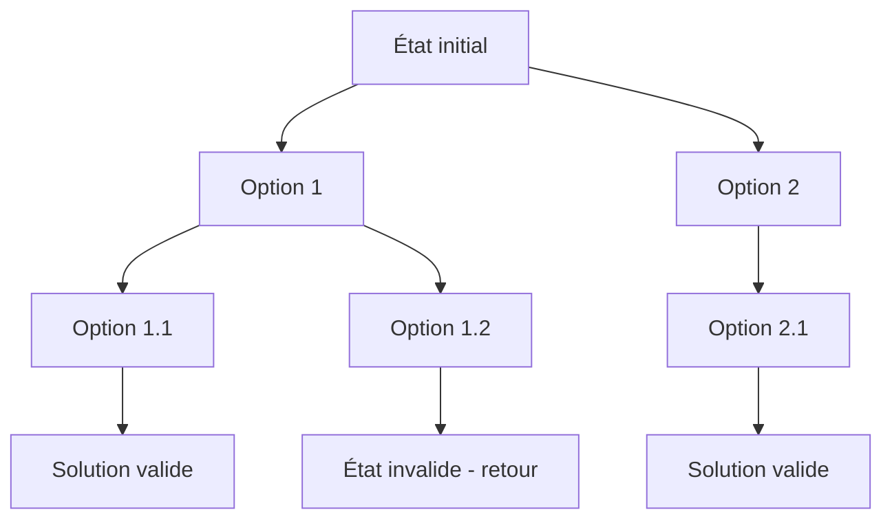

# Cours Avancé en Algorithmique — Séance 5 : Paradigmes Avancés  
## Partie 2 : Théorie — Backtracking (0.5h)  
### Contenu : Principe général — exploration d’un espace d’état, retour sur trace

---

## 1. Définition et principe

Le **Backtracking** est une méthode d’exploration systématique d’un espace d’états pour résoudre des problèmes combinatoires. Il consiste à construire progressivement des solutions candidates, en **explorant** un arbre implicite d’états, et à revenir **en arrière** (retour sur trace) dès que la continuité d’une solution paraît impossible.

---

## 2. Mécanisme clé : exploration et retour sur trace

- Le problème est modélisé par un **espace d’états** où chaque nœud représente une solution partielle.
- On construit récursivement la solution en ajoutant des éléments.
- Si un choix mène à un état invalide, on **recule** (backtrack) pour essayer une autre option.

---

## 3. Illustration Mermaid — Arbre exploratoire



- Dès qu’un **état invalide** (exemple D2) est rencontré, l’algorithme revient à la décision précédente pour en tester une autre.

---

## 4. Exemple : problème des N reines

- Placer \(n\) reines sur un échiquier \(n \times n\) sans qu’aucune ne se menace.
- Exploration ligne par ligne.
- Dès qu’une reine ne peut être placée dans aucune colonne d’une ligne donnée, on revient à la ligne précédente pour changer la position.

---

## 5. Caractéristiques du Backtracking

- **Complet** : explore toutes les solutions possibles à défaut de coupe.
- **Efficace avec une bonne stratégie de coupe** (pruning) pour éliminer rapidement les branches invalides.
- Approche naturellement récursive.

---

## 6. Synthèse de l’algorithme backtrack (pseudocode)

```
fonction backtrack(état courant)
    si état courant est solution complète
        afficher solution
    sinon
        pour chaque choix possible à partir de état courant
            si choix possible est valide
                backtrack(solongement)
                annuler choix (retour sur trace)
```

---

## 7. Sources consultées

- [GeeksforGeeks - Backtracking](https://www.geeksforgeeks.org/backtracking-algorithms/)
- [Wikipedia - Backtracking](https://en.wikipedia.org/wiki/Backtracking)
- [Programiz - Backtracking](https://www.programiz.com/dsa/backtracking)
- [TopCoder - Backtracking Introduction](https://www.topcoder.com/thrive/articles/backtracking)

---

Backtracking est un paradigme puissant pour résoudre les problèmes où la solution peut être construite étape par étape et invalidée dynamiquement. La maîtrise du retour sur trace et des stratégies d’élagage optimise considérablement la recherche des solutions.