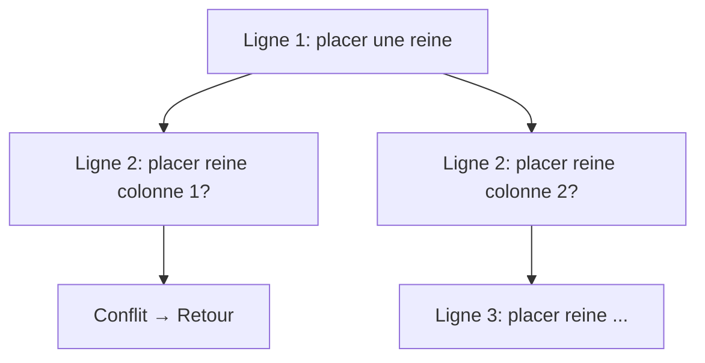
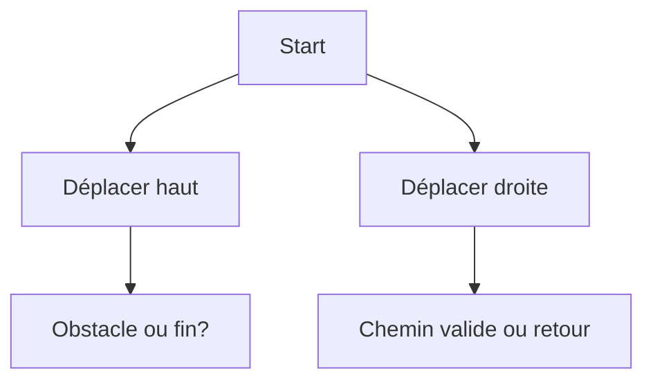
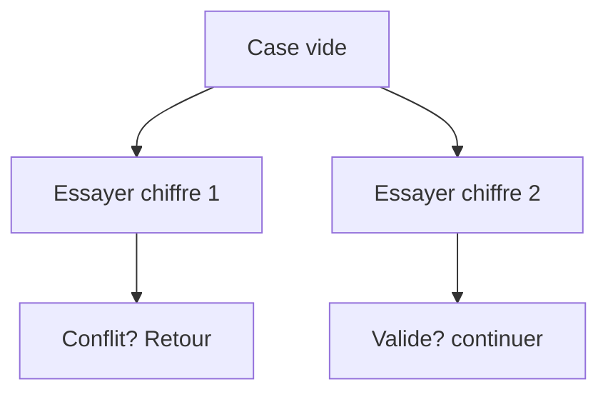

# Cours Avancé en Algorithmique — Séance 5 : Paradigmes Avancés  
## Partie 2 : Théorie — Backtracking (0.5h)  
### Contenu : Cas typiques — Problème des N-Dames, résolution de labyrinthe, Sudoku

---

## 1. Problème des N-Dames

### Description

Placer \(N\) dames sur un échiquier \(N \times N\) de sorte qu’aucune ne menace une autre (pas sur la même ligne, colonne ou diagonale).

### Caractéristiques Backtracking

- Exploration ligne par ligne : placer une reine par ligne.
- À chaque ligne, tester chaque colonne possible.
- Recul dès qu’aucune colonne ne permet une position valide (conflit avec une reine déjà placée).

### Illustration Mermaid

### Complexité

- Exponentielle en général, mais les coupes évitent d’explorer des branches invalides.

---

## 2. Résolution de labyrinthe

### Description

Trouver un chemin de la cellule de départ à la cellule d’arrivée dans une grille avec obstacles.

### Modélisation

- L’espace d’état : positions possibles dans la grille.
- Chaque état génère des mouvements valides dans les directions autorisées.
- Backtracking essaye une direction, revient si un cul-de-sac est rencontré.

### Illustration Mermaid

---

## 3. Sudoku

### Description

Remplir la grille \(9 \times 9\) pour que chaque ligne, colonne et région 3x3 contienne les chiffres 1 à 9 sans répétition.

### Backtracking appliqué

- Recherche case vide,
- Essai des chiffres valides (suivant règles),
- Retour sur trace si un choix bloque la complétion.

### Illustration Mermaid

### Remarque

Le backtracking peut être optimisé avec des heuristiques (choix cases avec plus de contraintes, propagation d’impact).

---

## 4. Sources consultées

- [GeeksforGeeks — N Queens Problem](https://www.geeksforgeeks.org/n-queen-problem-backtracking-3/)
- [Wikipedia — Maze solving algorithm](https://en.wikipedia.org/wiki/Maze_solving_algorithm)
- [Sudoku Solving — Backtracking](https://www.geeksforgeeks.org/sudoku-backtracking-7/)
- [Programiz — Backtracking example Sudoku](https://www.programiz.com/dsa/backtracking)

---

Ces problèmes illustrent la force du backtracking dans des espaces de recherche vastes, où la méthode explore systématiquement les solutions possibles tout en revenant sur ses choix dès qu’un blocage est détecté. Le succès au-delà de la naïveté repose sur l’utilisation d’heuristiques pour guider l’exploration.