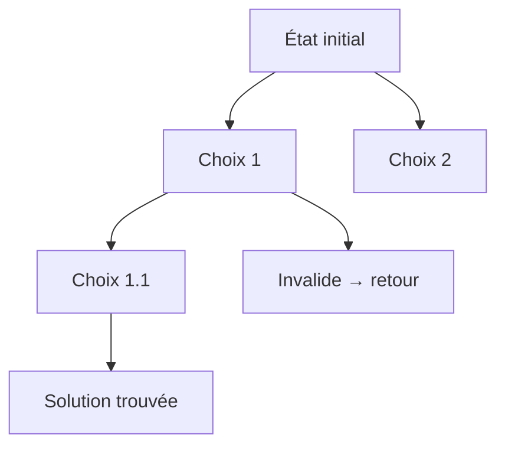

# Cours Avancé en Algorithmique — Séance 5 : Paradigmes Avancés  
## Partie 2 : Théorie — Backtracking (0.5h)  
### Contenu : Structure d’un algorithme de backtracking récursif

---

## 1. Rappel : principe général du backtracking

Le backtracking consiste à explorer récursivement toutes les solutions candidates à un problème combinatoire en construisant des solutions partielles étape par étape, et en revenant en arrière (backtracking) dès qu’une solution partielle ne peut mener à une solution complète valide.

---

## 2. Structure générique d’un algorithme de backtracking récursif

Un algorithme de backtracking se décompose typiquement en :

1. **Test de terminaison ou solution complète** : déterminer si l’état courant représente une solution complète valide.
2. **Génération des choix possibles** : obtenir la liste ou l’ensemble des prochaines décisions possibles à partir de l’état courant.
3. **Validation des choix** : vérifier pour chaque choix s’il est compatible avec les contraintes du problème.
4. **Récursion** : pour chaque choix valide, appliquer récursivement l’algorithme sur l’état modifié.
5. **Retour sur trace (undo)** : annuler le choix avant d’explorer les autres possibilités (neutre l’effet du choix précédent).

---

## 3. Modèle pseudocode

```
fonction backtrack(état_courant)
    si état_courant est une solution complète
        afficher_solution(état_courant)
        retourner

    pour chaque choix possible dans génération_choix(état_courant)
        si choix est valide
            appliquer_choix(état_courant, choix)
            backtrack(état_courant)
            annuler_choix(état_courant, choix)
```

---

## 4. Exemple concret : problème des N-Dames (placement récursif)

- **état_courant** : positions des reines placées sur les lignes précédentes.
- **génération_choix** : colonnes libres sur la ligne courante.
- **validité** : aucune attaque diagonale, horizontale ou verticale.
- **application choix** : placer la reine.
- **annulation choix** : retirer la reine (backtrack).

---

## 5. Illustration Mermaid de l’exploration et retour



L’algorithme explore une branche, revient en arrière lorsqu’elle est invalide ou que la solution est trouvée.

---

## 6. Points importants

- **Gestion explicite du retour** : chaque fois qu’un choix est fait, il faudra l’annuler avant d’explorer un autre choix.
- **Efficacité grâce à l’élagage** : validation anticipée pour éviter d’explorer les branches inutiles.
- **Utilisation de structures données** adaptées pour faciliter l’annulation (pile, tableau, etc.).

---

## 7. Sources consultées

- [GeeksforGeeks — Backtracking Pseudocode](https://www.geeksforgeeks.org/backtracking-algorithms/)
- [Wikipedia — Backtracking](https://en.wikipedia.org/wiki/Backtracking)
- [Programiz — Backtracking Tutorial](https://www.programiz.com/dsa/backtracking)
- [TopCoder — Backtracking guide](https://www.topcoder.com/thrive/articles/Backtracking)

---

Cette architecture récursive du backtracking constitue un cadre général adaptable à de nombreux problèmes combinatoires, permettant d’explorer toutes les solutions possibles de manière méthodique et contrôlée.